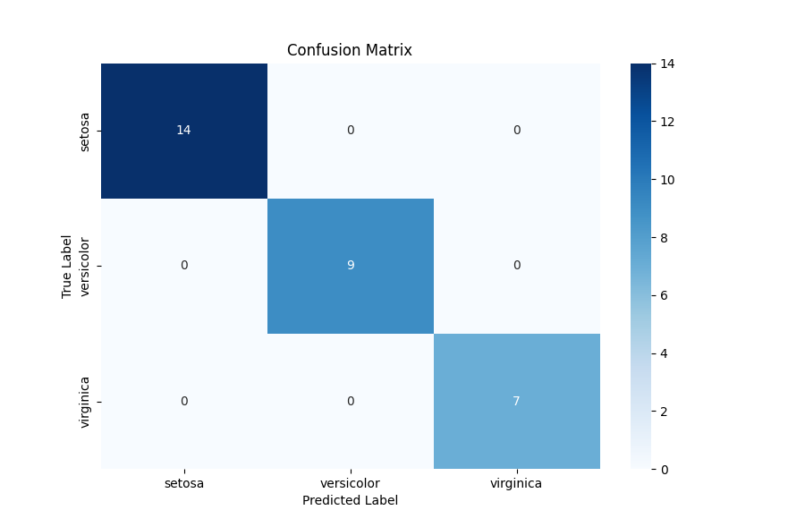

# Neuronales Netzwerk für den Iris-Datensatz

## Vorgehen

### Reproduzierbarkeit

Alle Funktionen, welche einen Zufallswert erzeugen wurden durch das Setzen eines Seeds festgelegt, um die Ergebnisse des Modells reproduzierbar zu machen.

### Loss Function und Optimierungsverfahren

Für die Klassifikation wurde die **Cross-Entropy Loss** Funktion verwendet, die besonders geeignet ist für mehrklassige Klassifikationsprobleme. Als Optimierungsverfahren kam der **Adam-Optimizer** zum Einsatz. Dieser Optimizer wurde ausgewählt, da er in der Lage ist, die Lernrate während des Trainings anzupassen, was zu einer effizienteren und stabileren Konvergenz führt.

### K-Fold Cross-Validation

Zur Bewertung des Modells wurde eine **K-Fold Cross-Validation** mit 5 Folds durchgeführt. Diese Technik ermöglicht es, das Modell auf verschiedenen Trainings- und Validierungsdatensätzen zu testen, wodurch die Generalisierungsfähigkeit des Modells besser eingeschätzt werden kann. Die folgende Grafik zeigt das Prinzip:


### Epochen und Training

Das Modell wurde über **30 Epochen** trainiert. Während jeder Epoche durchläuft das Modell den gesamten Trainingsdatensatz ohne den jeweiligen Validierungsdatensatz, um seine Gewichte kontinuierlich zu aktualisieren und zu verbessern.

## Modellarchitektur

Das verwendete neuronale Netzwerk besteht aus einer sequenziellen Schichtung von linearen Transformationen und ReLU-Aktivierungsfunktionen. Die ReLU (Rectified Linear Unit) Aktivierungsfunktion wurde aufgrund ihrer sparsity-induzierenden Eigenschaften und der Vermeidung des Vanishing-Gradient-Problems (ReLU hat konstante Ableitung für positive Werte) ausgewählt.

Das Netzwerk besteht aus vier linearen Schichten mit den folgenden Dimensionen:

Schicht 1: **4** Eingabeneuronen (entsprechend den Merkmalen des Iris-Datensatzes) <br>
Schicht 2: **10** <br>
Schicht 3: **10** <br>
Schicht 4: **3** Ausgabeneuronen (entsprechend den 3 Klassen des Iris-Datensatzes). <br>

```python
class NeuralNetwork(nn.Module):
    def __init__(self):
        super(NeuralNetwork, self).__init__()
        self.linear_relu_stack = nn.Sequential(
            nn.Linear(4, 10),
            nn.ReLU(),
            nn.Linear(10,10),
            nn.ReLU(),
            nn.Linear(10, 3)
        )
    def forward(self, x):
        logits = self.linear_relu_stack(x)
        return logits
```

## Ergebnisse

Das Modell wurde auf einem Testdatensatz validiert, der 20% der gesamten Daten ausmacht. Hierbei erreichte das Modell eine höhere Accuracy als auf den Validierungsdaten, was darauf hindeutet, dass kein Overfitting vorliegt.

- Accuracy auf Testdaten: 100.0 %
- Durchschnittliche Accuracy über alle Folds (Validierungsdaten): 90.0 %
- Cross-Validation Error: 0.296

## Visualisierung der Ergebnisse

Die folgende Konfusionsmatrix veranschaulicht die Leistung des Modells auf dem Testdatensatz:


