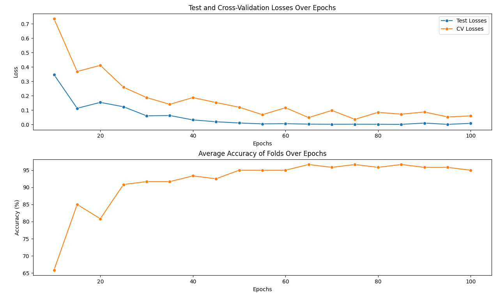

# Neuronales Netzwerk zur Klassifizierung des Iris-Datensatzes

## Vorgehen

### Reproduzierbarkeit

Alle Funktionen, welche einen Zufallswert erzeugen wurden durch das Setzen eines Seeds festgelegt, um die Ergebnisse des Modells reproduzierbar zu machen.

### Loss Function und Optimierungsverfahren

Für die Klassifikation wurde die **Cross-Entropy Loss** Funktion verwendet, die besonders geeignet ist für mehrklassige Klassifikationsprobleme. Als Optimierungsverfahren kam der **Adam-Optimizer** zum Einsatz. Dieser Optimizer wurde ausgewählt, da er in der Lage ist, die Lernrate während des Trainings anzupassen, was zu einer effizienteren und stabileren Konvergenz führt.

### K-Fold Cross-Validation

Zur Bewertung des Modells wurde eine **K-Fold Cross-Validation** mit 5 Folds durchgeführt. Diese Technik ermöglicht es, das Modell auf verschiedenen Trainings- und Validierungsdatensätzen zu testen, wodurch die Generalisierungsfähigkeit des Modells besser eingeschätzt werden kann. Die folgende Grafik zeigt das Prinzip:


## Modellarchitektur

Das verwendete neuronale Netzwerk besteht aus einer sequenziellen Schichtung von linearen Transformationen und ReLU-Aktivierungsfunktionen. Die ReLU (Rectified Linear Unit) Aktivierungsfunktion wurde aufgrund ihrer sparsity-induzierenden Eigenschaften und der Vermeidung des Vanishing-Gradient-Problems (ReLU hat konstante Ableitung für positive Werte) ausgewählt.

Das Netzwerk besteht aus vier linearen Schichten mit den folgenden Dimensionen:

Schicht 1: **4** Eingabeneuronen (entsprechend den Merkmalen des Iris-Datensatzes) <br>
Schicht 2: **10** <br>
Schicht 3: **10** <br>
Schicht 4: **3** Ausgabeneuronen (entsprechend den 3 Klassen des Iris-Datensatzes). <br>

```python
class NeuralNetwork(nn.Module):
    def __init__(self):
        super(NeuralNetwork, self).__init__()
        self.linear_relu_stack = nn.Sequential(
            nn.Linear(4, 10),
            nn.ReLU(),
            nn.Linear(10,10),
            nn.ReLU(),
            nn.Linear(10, 3)
        )
    def forward(self, x):
        logits = self.linear_relu_stack(x)
        return logits
```

### Epochen und Training

Das neuronale Netzwerk wurde über eine unterschiedliche Anzahl von Epochen hinweg trainiert, um die optimale Epochenzahl zu ermitteln, die das Modell mit dem geringsten Cross Validation Loss (CVL) hervorbringt. In jeder Epoche wird der gesamte Trainingsdatensatz für alle k-fold Splits durchlaufen, sodass das Modell seine Gewichte kontinuierlich anpasst und verbessert.

Der folgende Plot zeigt die Ergebnisse für Epochenzahlen von 10 bis 100. Während der CVL zunächst immer weiter abnimmt, ist 80 Epochen ein Anstieg und kein erneuter Abstieg zu beobachten, was auf ein Overfitting der Trainingsdaten hindeuten könnte.



Schliesslich wurde das Modell ausgewählt, das über **75 Epochen** trainiert wurde.

## Ergebnisse

Das Modell wurde auf einem Testdatensatz validiert, der 20% der gesamten Daten ausmacht. Hierbei erreichte das Modell eine höhere Accuracy als auf den Validierungsdaten, was darauf hindeutet, dass kein Overfitting vorliegt.

- **Accuracy auf Testdaten: 100.0 %**
- Durchschnittliche Accuracy über alle Folds (Validierungsdaten): 96.67 %
- Cross-Validation Error: 0.0365

## Visualisierung der Ergebnisse

Die folgende Konfusionsmatrix veranschaulicht die Leistung des Modells auf dem Testdatensatz:


